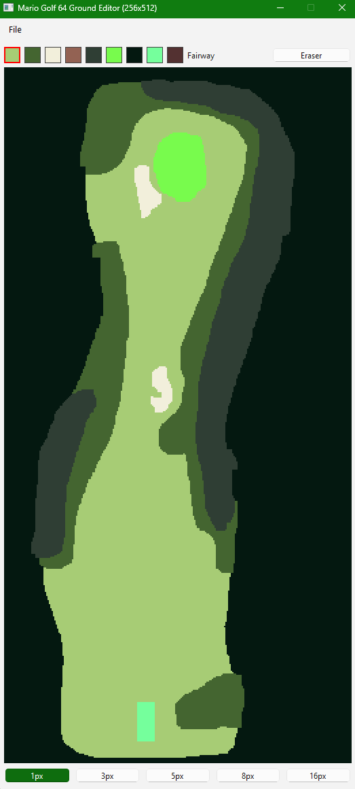

# Mario Golf 64 Ground Editor v1.0.0

Mario Golf 64 Fixed-sized PNG pixel editor built in python (PySide6) with a fixed color palette representing ground types in Mario Golf 64.

- Canvas: **256×512** px (RGBA) (fixed pixel size that MG64 Hole Editor expects to convert to ground type .att file)
- Default Canvas colour is OB (#041810)
- Tools: draw, erase, 5 rectangle brush sizes, pixel grid toggle
- Palette: fixed set of HEX colors with tooltips which match corresponding ground types in Mario Golf (see Ground Type Map)
- Files: New / Open / Save (PNG)

---

## Requirements

- Python **3.9+**
- `PySide6` (installed via `requirements.txt`)

---

## Ground Type Map

| Ground ID | Ground Type   | Ground Hex Value |
| --------- | ------------- | ---------------- |
| 0         | Fairway       | #A7CC75          |
| 1         | Rough         | #446530          |
| 2         | Bunker        | #F2EFDB          |
| 3         | Bare Ground   | #936253          |
| 4         | Cart Way      | ???              |
| 5         | Deep Rough    | #2F3E34          |
| 6         | Green         | #78FB4D          |
| 7         | Out of Bounds | #041810          |
| 8         | Tee Ground    | #75FF9C          |
| 9         | Rock          | #533131          |

[Reference](https://hack64.net/wiki/doku.php?id=mario_golf:hole_components)

## Project Layout

```bash
mg64-ground-editor/
├─ requirements.txt
└─ mg64_ground_editor/
   ├─ __init__.py
   ├─ __main__.py
   └─ app.py
```

## Usage

- Pick color: click a swatch (active swatch shows a red border)
- Brush size: choose 1 / 3 / 5 / 8 / 16 px
- Draw: left-click or drag
- Erase: toggle Eraser then left-click/drag. Eraser colour is OB
- Files: File → New / Open / Save
- Opened images are enforced to 256×512 (resampled if needed)

## Quick Start (with `.venv` virtual env)

### 1) Create and activate the virtual env

**macOS / Linux**

```bash
python3 -m venv .venv
source .venv/bin/activate
python -m pip install --upgrade pip
pip install -r requirements.txt
```

**Windows**

```powershell
py -3 -m venv .venv
.\.venv\Scripts\Activate.ps1
python -m pip install --upgrade pip
pip install -r requirements.txt
```

### 2) Run

```bash
python -m mg64_ground_editor
```

### 3) Create Ground for Course

**e.g.**



### 4) Save to .png

### 5) Use MG64HoleEditor by DeathBasket and convert .png to .att

## Planned Features

- Improve editor (fill bucket, shapes)
- Add ability to export to .att directly
